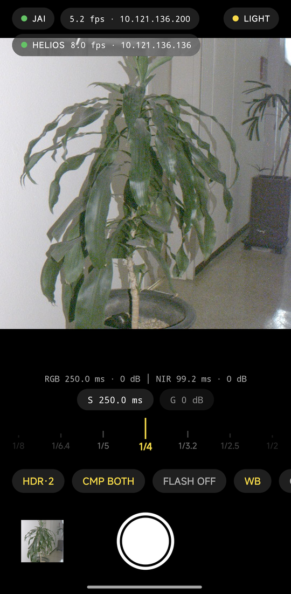
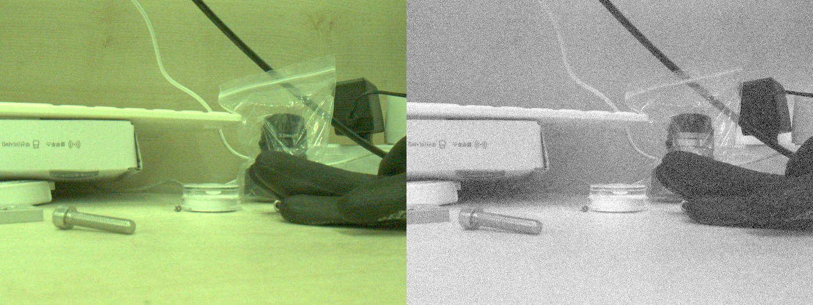
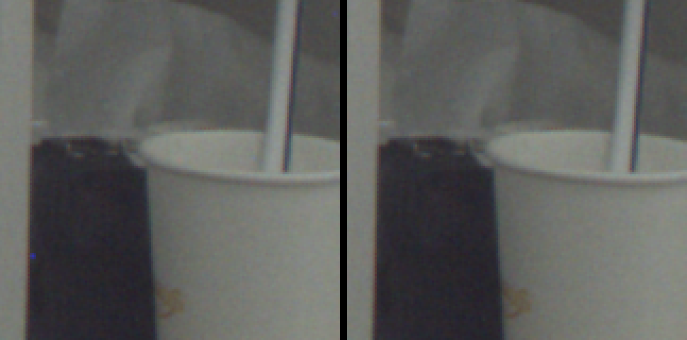
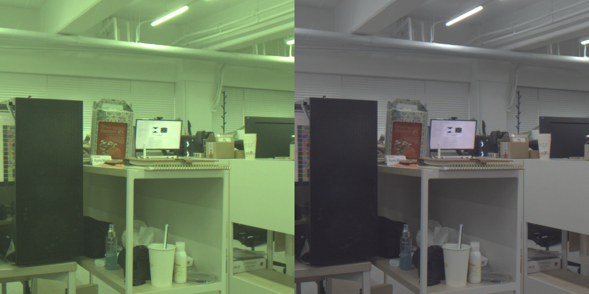
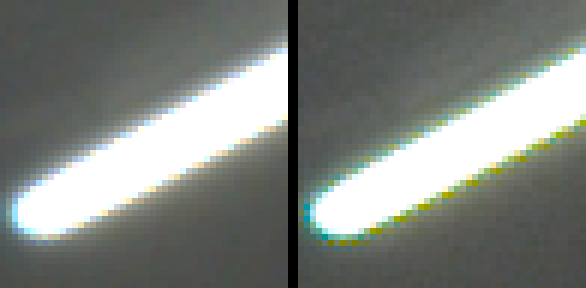
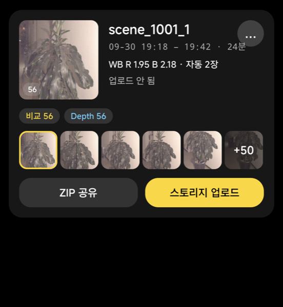

# MobileJai

JAI **FS-1600D-10GE**(2-CCD RGB + NIR, GigE Vision) 카메라를 안드로이드 폰에서 직접 제어하는 촬영 앱입니다.
같은 리그의 **Lucid Helios2** ToF 깊이 카메라와 **Advanced Illumination DCS-103E** NIR 조명도 함께 다룹니다.

카메라 SDK(eBUS 등)는 쓰지 않습니다. GVCP/GVSP와 GenICam을 Kotlin으로 처음부터 구현했습니다.

<p align="center"></p>
<p align="center"><i>카메라 화면. 프리뷰 영역과 상단 연결 표시는 저장된 실제 촬영본과 예전 연결 화면으로 합성했습니다.</i></p>


*한 번의 셔터로 받은 RGB(WB 1:1:1 원본)와 NIR 프레임*

---

## 기능

### 촬영
- **RGB·NIR 동시 촬영:** 두 센서의 셔터와 게인을 따로 조절합니다.
  - 카메라 AWB는 끄고 WB를 1:1:1로 고정합니다.
  - 촬영은 BayerRG12 / Mono12 원본으로 받습니다.
- **정사각 촬영:** 카메라가 리그에 시계 방향 90°로 달려 있습니다. 그래서 데이터를 반시계 90°로 돌리고 1080×1080 정사각으로 잘라 저장합니다.
- **프리뷰:** 카메라에서 8-bit에 NIR binning을 걸어 대역폭을 줄이고 약 5fps로 받습니다. 셔터를 누를 때만 전체 해상도 12-bit로 전환합니다.
- **HDR (4장):** t/64, t/8, t, 8t를 찍고 Debevec 방식(hat × 노출시간 가중치)으로 float32 radiance map을 만듭니다. 약 3.3초가 걸립니다.
- **HDR·2 (빠른 2장):** t/8 다음에 t를 찍어 하이라이트를 3스톱 늘립니다.
  - 셔터를 바꾼 바로 다음 프레임을 쓰기 때문에 두 프레임이 333ms 간격입니다.
  - 버스트마다 실측 밝기 비율을 메타데이터에 남깁니다. 실측값은 8.03~8.07이었습니다.
- **Flash 비교 촬영:** NIR 조명, 폰 플래시, 또는 둘 다 켜고 HDR을 찍습니다. 이어서 같은 셔터로 조명을 끄고 다시 찍습니다. 뷰어에서는 lit, ambient, **active**(lit − ambient)를 볼 수 있습니다.
- **Helios depth:** JAI 촬영과 시각을 맞춘 depth 프레임을 함께 저장합니다(x/y/z/intensity).
  - JAI 노출 중에는 Helios 광원을 끕니다.
  - 측정 범위를 넘어 가깝게 접혀 찍힌 점(phase wrap)은 펴서 제자리로 돌립니다.
- **프리뷰 WB 토글:** 글로벌 표시 WB를 켜거나 꺼서 센서 원본 색과 비교합니다. 표시용이고 저장 데이터는 바뀌지 않습니다.

### 갤러리와 뷰어
- **제스처:** 핀치 줌, 스와이프 넘김, 이웃 사진 미리 로드를 지원합니다.
- **보기 전환:** RGB, NIR, DEPTH를 오갈 수 있습니다. HDR은 EV를 조절하며 볼 수 있고, 브래킷 프레임을 하나씩 볼 수도 있습니다.
- **DEPTH → JAI:** Helios→JAI 캘리브레이션으로 depth를 JAI 영상 위에 겹쳐 봅니다.
- **캘리브레이션 화면:** JAI와 Helios 영상에서 대응점을 찍습니다. 강건한 방식(RANSAC과 LM)으로 정합 파라미터를 풉니다.

### 센서 결함 보정
RGB 센서에는 white/dead 픽셀이 있습니다. 두 가지 방법으로 찾아서, 같은 색의 정상 이웃 픽셀 중앙값으로 메웁니다. 저장되는 원본은 그대로 둡니다.
- **결함 맵:** 촬영본 통계로 만든 고정 맵입니다. 장노출에서 생기는 dark-current hot pixel도 포함합니다.
- **비교 촬영 쌍 마스크:** lit과 ambient 양쪽에서 똑같이 튀는 픽셀을 센서 결함으로 보고 지웁니다.


*결함 보정 전(왼쪽)과 후(오른쪽)*

### White balance
센서 출력은 WB 1:1:1이라 녹색이 강합니다. 표시용으로만 글로벌 WB(R 1.62, B 2.57)를 적용합니다. 씬 단위로 묶으면 씬에 속한 촬영본으로 WB를 다시 계산합니다.


*WB 1:1:1 원본(왼쪽)과 표시 WB 적용(오른쪽)*

디모자익은 bilinear를 씁니다. MHC는 포화된 하이라이트 경계에서 색 번짐이 생겨서 쓰지 않습니다.


*bilinear(왼쪽)와 MHC(오른쪽). MHC는 포화 경계에 색 테두리가 생깁니다.*

---

## 씬 관리와 Export

갤러리에서 썸네일을 **길게 누른 채 드래그**하면 여러 장을 한 번에 선택할 수 있습니다. 선택한 촬영본은 "씬"으로 묶습니다.
- 한 씬은 하나의 WB를 공유합니다. 씬 촬영본들의 gray-world 값의 중앙값으로 자동 계산합니다.
- flash 비교 촬영의 lit과 ambient는 항상 같은 씬으로 묶입니다.


*씬 목록 페이지: 대표 이미지, 촬영 시각과 걸린 시간, 구성, WB, 업로드 상태, 촬영본 줄*

씬 카드에서 바로 내보낼 수 있습니다.
- **ZIP 공유:** 안드로이드 공유 시트로 보냅니다.
- **스토리지 업로드:** SMB 공유 폴더(`\\host\share\folder\<씬이름_시각>\`)로 올립니다.
  - 진행률 바에 전송 속도와 남은 시간이 표시됩니다.
  - 연결이 끊기면 다시 접속해서 실패한 파일부터 이어 올립니다.
  - 비밀번호는 폰에서만 입력합니다. Android Keystore(AES-GCM)로 암호화해서 폰에만 저장하고, 코드나 저장소에는 들어가지 않습니다.

### Export 파일 구성

모든 이미지는 결함 보정과 씬 WB를 적용한 상태입니다. 단위는 모두 선형입니다(black 99를 뺀 카운트).

| 파일 | 형식 | 내용 |
|---|---|---|
| `rgb_lit.tiff`, `rgb_passive.tiff` | float16, RGGB Bayer | HDR, 기준 노출에서의 카운트 × WB(픽셀 위치별) |
| `nir_lit.tiff`, `nir_passive.tiff` | float16 | HDR NIR |
| `rgb.tiff` / `nir.tiff` (단일 촬영) | uint16 | RGB는 Bayer, 12-bit 카운트 |
| `depth_lit_on_jai_mm.tiff` | uint16 mm | JAI 1080×1080 격자 위의 깊이(z). 점이 없으면 0 |
| `depth_lit_on_jai_preview.jpg` | JPEG | NIR 위에 depth를 색으로 겹친 정렬 확인용 그림 |
| `depth_lit_raw_{x,y,z,intensity}.tiff` | uint16 | Helios 원본 그대로. mm = 값 × scale + offset |
| `metadata_lit.json`, `metadata_passive.json` | JSON | 노출, 게인, 조명, depth, 캘리브레이션 정보 |
| `scene.json` | JSON | 씬 WB, 처리 방식, 파일별 단위, depth 캘리브레이션 |

- **RGB가 Bayer인 이유:** RGB는 디모자익하지 않은 RGGB 모자이크로 저장합니다(짝수 행·짝수 열이 R, 홀수 행·홀수 열이 B). 디모자익한 3채널은 데이터가 3배인데, 받는 쪽에서 언제든 다시 만들 수 있습니다.
- **float16 정밀도:** 상대 오차가 1/2048 이하로, 12-bit 센서 잡음보다 작습니다. 65504를 넘을 만큼 밝은 장면은 2의 거듭제곱으로 값을 줄여 저장하고, 그 배율을 TIFF ImageDescription에 적습니다.
- **용량:** 비교 촬영 1개는 대략 6~7MB입니다.

Python에서 읽는 예시입니다.

```python
import tifffile, cv2, numpy as np
bayer = tifffile.imread("rgb_lit.tiff").astype(np.float32)    # 1080x1080, RGGB
rgb = cv2.cvtColor(bayer, cv2.COLOR_BayerRG2RGB)               # 필요할 때 디모자익
depth_mm = tifffile.imread("depth_lit_on_jai_mm.tiff")         # 0 = 점 없음
```

---

## 하드웨어 연결

```
JAI FS-1600D ─┐
Helios2 ──────┼─ PoE 스위치 ─ USB 이더넷 어댑터 ─ 안드로이드 폰 (이더넷 테더링 ON)
DCS-103E ─────┘
```

- **폰:** **이더넷 테더링**을 켜야 `eth0`에 IPv4 주소가 잡힙니다. 테더링 서브넷은 재부팅할 때마다 바뀔 수 있습니다.
- **JAI:** DHCP를 받지 않고 link-local(169.254.x.x)에 머뭅니다. 앱이 브로드캐스트로 찾은 뒤 MAC 주소로 FORCEIP를 보내 테더링 서브넷으로 옮깁니다.
- **Helios와 DCS-103E:** 테더링 DHCP로 주소를 받습니다. DCS는 UDP 7777로 제어합니다. TCP는 명령을 빠뜨려서 쓰지 않습니다.
- **대역폭:** RGB와 NIR 12-bit 전체 해상도를 손실 없이 받으려면 packet delay(SCPD)가 약 80µs 필요합니다. 그래서 전체 해상도 촬영은 약 3fps입니다.

---

## 프로젝트 구조

| 모듈 | 내용 |
|---|---|
| `camera-jai` | GVCP 제어, GVSP 수신, GigE 장치 검색과 FORCEIP, 최소 GenICam 노드맵(SwissKnife 수식 포함), `JaiCamera`(프리뷰/촬영 모드, 버스트), HDR 합성, 결함 맵, 디모자익, 표시 렌더링 |
| `camera-helios` | Helios2 제어(동작 모드와 노출, ABCY16 depth), Helios→JAI 정합(`Registration`), 위상 래핑 보정(`PhaseUnwrap`) |
| `light-dcs` | DCS-103E 조명 컨트롤러(UDP) |
| `app` | 카메라 UI, 갤러리, 뷰어, 캘리브레이션, 저장(TIFF/JSON via MediaStore), 씬 관리, Export, SMB 업로드 |

저장 위치는 다음과 같습니다.
- `Documents/MobileJai/`: 원본 TIFF, 메타데이터 JSON, `scenes.json`
- `Pictures/MobileJai/`: 미리보기 JPEG

## 빌드

Android Studio의 JDK를 쓰고, minSdk 29입니다.

```bash
./gradlew :app:assembleDebug testDebugUnitTest
```

```bash
adb install -r app/build/outputs/apk/debug/app-debug.apk
```
